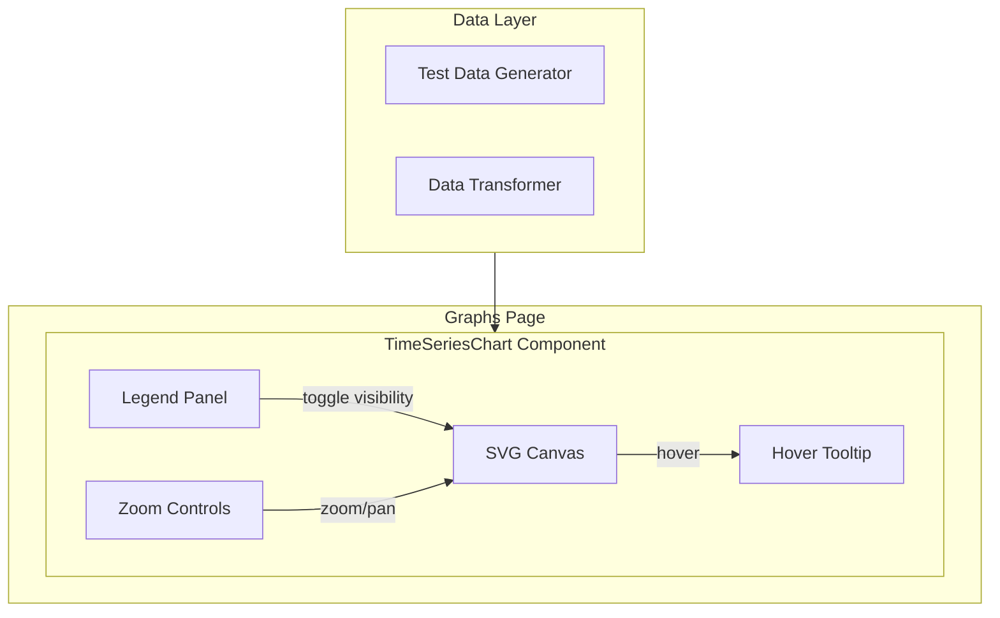

# Time Series Graphs UI Section

## Архитектура компонента




## Структура файлов

Новая папка: `[ui-app/src/components/graphs/](ui-app/src/components/graphs/)`

```
graphs/
├── index.ts                    # Экспорты
├── TimeSeriesChart.tsx         # Основной компонент графика
├── types.ts                    # TypeScript типы
├── Legend.tsx                  # Компонент легенды
├── ChartCanvas.tsx             # SVG canvas для отрисовки
├── ZoomControls.tsx            # Контролы масштабирования
├── Tooltip.tsx                 # Тултип при наведении
├── utils/
│   ├── colors.ts               # Палитра из 20 цветов
│   ├── scales.ts               # Функции масштабирования осей
│   └── data-generator.ts       # Генератор тестовых данных
└── hooks/
    ├── useChartDimensions.ts   # Хук для размеров canvas
    └── useZoom.ts              # Хук для zoom/pan
```

## Ключевые решения

### 1. Отрисовка на SVG (не Canvas)

- Лучшая интеграция с React
- Проще обработка событий hover/click
- Поддержка CSS-стилизации
- Достаточная производительность для 20 линий x 120 точек

### 2. Масштабирование

- **Wheel zoom**: колесо мыши для zoom in/out
- **Drag pan**: перетаскивание для смещения
- **Кнопки**: +/- для zoom, Reset для сброса
- **Brush selection**: выделение области для zoom (опционально)

### 3. Обработка null-значений

- Разрыв линии в точках с null
- Визуально: линия прерывается и продолжается после null

```typescript
// Пример: [1, 2, null, 4, 5] -> две отдельные линии
// Линия 1: точки 0-1 (значения 1, 2)
// Линия 2: точки 3-4 (значения 4, 5)
```

### 4. Легенда

- Список всех 20 серий с цветом и названием
- Клик по элементу скрывает/показывает линию
- Визуальная индикация скрытых серий (opacity/strikethrough)

### 5. Палитра цветов

20 различимых цветов с хорошим контрастом для светлой/темной темы.

## Интеграция

### Роутинг

Добавить в `[ui-app/src/App.tsx](ui-app/src/App.tsx)`:

```typescript
import GraphsPage from './pages/graphs';
// ...
<Route path="/graphs" element={<GraphsPage />} />
```

### Навигация

Добавить в `[ui-app/src/config/nav.tsx](ui-app/src/config/nav.tsx)`:

```typescript
{
  name: 'Graphs',
  href: '/graphs',
  icon: ChartBarIcon,
}
```

### Страница

Создать `[ui-app/src/pages/graphs.tsx](ui-app/src/pages/graphs.tsx)` с использованием компонента `TimeSeriesChart`.

## API компонента

```typescript
interface TimeSeriesChartProps {
  data: TimeSeries[];        // Массив временных рядов
  width?: number;            // Ширина (по умолчанию 100%)
  height?: number;           // Высота (по умолчанию 400px)
  showLegend?: boolean;      // Показывать легенду
  enableZoom?: boolean;      // Включить масштабирование
}

interface TimeSeries {
  id: string;
  name: string;
  values: (number | null)[];  // null = отсутствие данных
  color?: string;             // Опциональный цвет
}
```

## Тестовые данные

Генератор создаст 20 временных рядов по 120 значений:

- Базовые синусоиды/косинусоиды с разными фазами и амплитудами
- Случайный шум
- ~10-15% null-значений в случайных позициях

