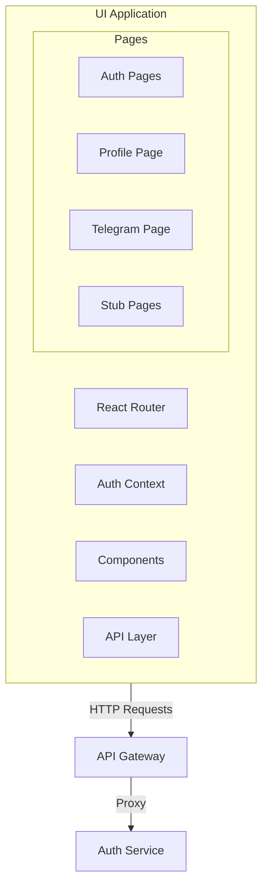

# План реализации UI сервиса

## Архитектура приложения




## Структура проекта

```javascript
ui-app/
├── src/
│   ├── components/
│   │   ├── ui/              # Переиспользуемые UI компоненты
│   │   ├── forms/           # Формы (login, register, etc.)
│   │   └── layout/          # Layout компоненты (Header, Sidebar)
│   ├── pages/
│   │   ├── auth/            # SignIn, SignUp, ResetPassword
│   │   ├── profile/         # Profile page
│   │   ├── telegram/        # Telegram integration
│   │   └── stubs/           # Заглушки (Statistics, WordPress, etc.)
│   ├── contexts/            # React Context (AuthContext)
│   ├── hooks/               # Custom hooks
│   ├── services/            # API services
│   ├── types/               # TypeScript interfaces
│   └── utils/               # Utility functions
├── package.json
├── vite.config.ts
├── tailwind.config.js
└── tsconfig.json
```


## Технологический стек

| Категория | Технология ||-----------|------------|| Framework | React 18 + TypeScript || Bundler | Vite || Styling | Tailwind CSS || Routing | React Router v6 || State | React Context + useReducer || Data Fetching | React Query (TanStack Query) || Validation | Zod || HTTP Client | Axios |

## Ключевые компоненты

### 1. Авторизация и состояние

- `AuthContext` - хранение токенов, состояния пользователя
- Автоматический refresh токена при истечении access_token
- Persisted state в localStorage

### 2. API интеграция

Endpoints из существующего auth сервиса:

- `POST /register` - регистрация
- `POST /login` - авторизация  
- `POST /logout` - выход
- `POST /all_logout` - выход со всех устройств
- `GET /profile` - получение профиля
- `PUT /profile` - обновление профиля
- `POST /reset-password` - сброс пароля
- `POST /refresh` - обновление токенов

### 3. Защищенные маршруты

- `ProtectedRoute` HOC для проверки авторизации
- Redirect на login при отсутствии токена

---

## Этапы реализации

### Этап 1: Инициализация проекта

- Создание Vite + React + TypeScript проекта
- Настройка Tailwind CSS
- Конфигурация путей и алиасов

### Этап 2: Базовая инфраструктура

- Настройка React Router
- Создание AuthContext и reducer
- API client с interceptors для токенов
- Базовые UI компоненты (Button, Input, Card)

### Этап 3: Авторизация

- Страница регистрации (SignUp)
- Страница входа (SignIn)
- Форма сброса пароля
- Protected routes

### Этап 4: Профиль пользователя

- Отображение данных профиля
- Форма редактирования (email, password)
- Верификация email
- Кнопки Logout / Logout All

### Этап 5: Telegram интеграция

- Форма для api_id, api_hash
- Динамические поля для chats_to_read, channels_to_post
- Условия фильтрации сообщений
- Checkbox для обработки с описанием

### Этап 6: Заглушки

- Statistics (placeholder)
- WordPress, Twitter, VKontakte, Custom URL (заглушки)

### Этап 7: Финализация

- Dark mode toggle
- Error boundaries