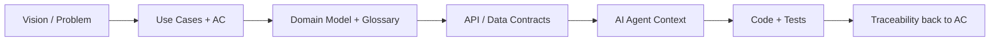
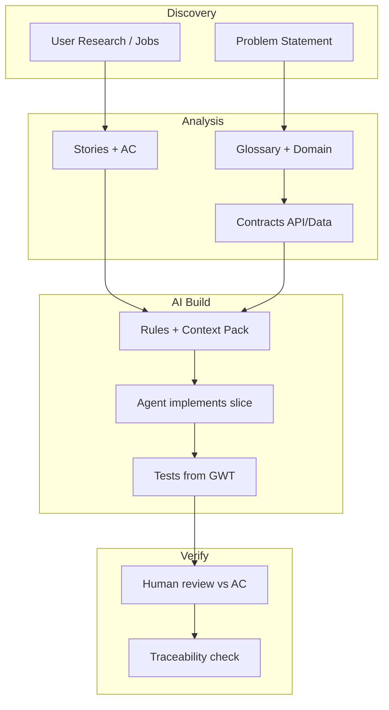

# Системная аналитика в AI PDLC: как оптимизировать, какие артефакты и требования

В **AI PDLC** (Product Development Lifecycle с участием AI-агентов) системная аналитика перестаёт быть «документом для людей» и становится **исходным контекстом для генерации кода**. От качества и структуры аналитики напрямую зависит, насколько точно AI реализует задуманное с первого прохода.

---

## Главный сдвиг мышления

Классическая аналитика: длинные Word/PDF, narrative, много неявных допущений.

AI PDLC-аналитика: **структурированные, проверяемые, машиночитаемые спецификации** с явными границами scope, терминами и критериями приёмки.



---

## Как оптимизировать аналитику под AI

### 1. Принцип «AI-ready spec slice»
Не пишите монолитный ТЗ на 80 страниц. Делите на **вертикальные слайсы** (feature → 1–3 user story → контракты → тесты), каждый из которых агент может реализовать за одну сессию.

**Хороший слайс:** «Создание поста через API» — модель, эндпоинт, валидация, 5 acceptance criteria, 3 edge case.

**Плохой слайс:** «Модуль контент-менеджмента» без границ.

### 2. Структура важнее объёма
AI лучше работает с:
- таблицами полей и правил;
- Given-When-Then сценариями;
- OpenAPI / JSON Schema / Pydantic-подобными описаниями;
- явными списками «делать / не делать» (in/out of scope).

Хуже — абзацы «система должна быть удобной и масштабируемой» без метрик.

### 3. Один источник правды по терминам
Glossary + domain model в начале. Если в одном месте «пост», в другом «сообщение», агент создаст дублирующие сущности.

### 4. Разделение WHAT и HOW
- **Аналитик / архитектор:** что делает система, бизнес-правила, интеграции, NFR.
- **AI / разработчик:** как реализовать в рамках stack и ADR.

Если в аналитике уже «используй Redis Streams» — это ADR, не требование.

### 5. Контекстные «правила для агента»
В AI PDLC аналитика продолжается в:
- `.cursor/rules/` — стандарты кода, стек, паттерны;
- `AGENTS.md` — как агенту работать с репозиторием;
- skills — повторяемые workflow.

Это часть аналитической работы, не «техническая мелочь».

### 6. Traceability by design
Каждый артефакт с ID:
- `US-042`, `BR-017`, `NFR-003`, `API-posts-create`.

В acceptance criteria и тестах — ссылки на эти ID. Так проще ревьюить AI-результат и не терять требования.

### 7. «Контракты раньше кода»
Для API-first и event-driven: сначала OpenAPI / AsyncAPI / схемы событий, потом реализация. AI стабильнее генерирует код от контракта, чем от prose.

---

## Какие арteфакты создавать (минимальный и расширенный набор)

### Обязательный минимум (MVP AI PDLC)

| Артефакт | Зачем для AI |
|----------|--------------|
| **Problem / Vision (1 стр.)** | Зачем фича, кому, какой outcome |
| **Glossary + Domain Model** | Единые термины и сущности |
| **User Stories + Acceptance Criteria** | Проверяемый scope |
| **Use Case / Sequence (критические потоки)** | Порядок шагов, акторы, ошибки |
| **Functional Requirements (FR)** | Поведение без двусмысленности |
| **NFR** | perf, security, SLA, лимиты |
| **API Contract (OpenAPI)** | Точная генерация эндпоинтов |
| **Data Model (ERD + field rules)** | Таблицы, связи, constraints |
| **Test Scenarios (GWT)** | Автогенерация и проверка |
| **In/Out of Scope** | Защита от «улучшений» агента |

### Рекомендуемый набор для зрелого процесса

| Артефакт | Когда нужен |
|----------|-------------|
| **Context Map / C4 (Container, Component)** | Микросервисы, несколько bounded context |
| **Integration Matrix** | Много внешних систем |
| **State Machine** | Сложные статусы (заказ, пост, биллинг) |
| **Business Rules Catalog** | Много if/then правил |
| **ADR (Architecture Decision Records)** | Выбор стека, паттернов, trade-offs |
| **Security & Compliance Spec** | PII, auth, audit, GDPR |
| **Error Catalog** | Коды ошибок, retry, idempotency |
| **Observability Spec** | Метрики, логи, алерты |
| **Migration / Rollout Plan** | Изменения схемы, feature flags |
| **AI Context Pack** | Сводный markdown для агента на фичу |

### Формат «AI Context Pack» (на одну фичу)

Один файл или папка `docs/features/US-042-create-post/`:

```
README.md           — цель, scope, ссылки
glossary.md         — термины фичи
requirements.md     — FR + NFR + business rules
api.yaml            — OpenAPI
data-model.md       — таблицы/поля/constraints
sequences.md        — mermaid sequence diagrams
acceptance.md       — GWT сценарии
edge-cases.md       — граничные и негативные кейсы
out-of-scope.md     — явные исключения
```

Агент получает **одну точку входа**, а не ищет по Confluence.

---

## Требования к качеству аналитики в AI PDLC

### Функциональные требования к самой аналитике

1. **Однозначность** — нет «быстро», «удобно», «при необходимости» без чисел и условий.
2. **Проверяемость** — у каждого FR есть acceptance criterion или тест-сценарий.
3. **Полнота в рамках slice** — happy path + основные негативные сценарии + границы данных.
4. **Консистентность** — одни и те же имена сущностей в stories, API, ERD, коде.
5. **Атомарность** — одно требование = одно утверждаемое поведение.
6. **Приоритизация** — MoSCoW или P0/P1, чтобы AI не раздувал scope.
7. **Версионирование** — git для specs, как для кода.
8. **Traceability** — story → FR → API → test → commit.

### NFR, которые особенно важны для AI-разработки

| Категория | Пример формулировки |
|-----------|---------------------|
| Performance | p95 < 200 ms при 100 RPS |
| Security | JWT, RBAC roles: admin, user |
| Idempotency | POST с `Idempotency-Key`, TTL 24h |
| Data | max text length 4096, UTF-8 |
| Reliability | retry 3x, exponential backoff |
| Observability | log `request_id`, metric `posts_created_total` |

Без NFR агент «додумает» сам — часто не так, как нужно.

### Anti-patterns (чего избегать)

- Длинные narrative без структуры
- Требования без acceptance criteria
- Смешение бизнес-логики и технической реализации
- Неявные интеграции («как-то связать с CRM»)
- Отсутствие error handling в use case
- Один огромный PRD на весь продукт

---

## Процесс: как встроить в AI PDLC



**Роли:**
- **Системный аналитик** — stories, rules, contracts, edge cases
- **Solution architect** — C4, ADR, integration, NFR
- **AI engineer / dev** — rules, context packs, prompt на slice
- **QA** — GWT, контрактные тесты, проверка traceability

---

## Метрики эффективности аналитики в AI PDLC

| Метрика | Что показывает |
|---------|----------------|
| **First-pass acceptance rate** | % AC, закрытых с первой генерации |
| **Rework ratio** | Сколько итераций до merge |
| **Spec drift** | Расхождение кода и контракта |
| **Ambiguity index** | Число вопросов агента/разработчика на story |
| **Coverage** | % FR с тестами и AC |

Если first-pass < 60% — обычно проблема в аналитике, а не в модели.

---

## Практические рекомендации

1. **Шаблонизируйте** — один шаблон feature pack для всех фич.
2. **Definition of Ready для AI** — story не идёт агенту, пока нет: glossary, AC, API/data contract, edge cases, out of scope.
3. **Definition of Done** — все AC закрыты, контракты совпадают, traceability есть.
4. **Живые контракты** — OpenAPI и схемы в репозитории, не в Confluence-only.
5. **Малые итерации** — slice на 2–4 часа работы агента, не на спринт.
6. **Human-in-the-loop на границах** — аналитик ревьюит контракты и AC; агент пишет boilerplate и CRUD.

---

## Краткий чеклист «готово ли к AI»

- [ ] Есть glossary и domain model
- [ ] User story с ID и приоритетом
- [ ] ≥3 acceptance criteria (happy + negative)
- [ ] OpenAPI / data schema для затронутых интерфейсов
- [ ] Edge cases и out of scope явно перечислены
- [ ] NFR для security, perf, limits
- [ ] GWT-сценарии для критического пути
- [ ] Context pack собран в одну папку
- [ ] `.cursor/rules` или `AGENTS.md` описывают stack и conventions

---

Если нужно, могу в Agent mode помочь **собрать шаблон AI Context Pack** под ваш стек (FastAPI, PostgreSQL, микросервисы из вашего репозитория) или **разобрать конкретную фичу** по этой схеме.